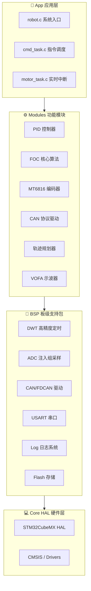

# milFOC — 基于 STM32G431 的高性能 FOC 电机驱动器

[](https://www.st.com/en/microcontrollers-microprocessors/stm32g431.html)
[](https://www.st.com/en/embedded-software/stm32cube-mcu-packages.html)
[](https://developer.arm.com/tools-and-software/open-source-software/developer-tools/gnu-toolchain)
[](LICENSE)

> **milFOC** 是一款面向高性能 PMSM/BLDC 电机驱动器的开源 FOC 固件项目，基于 **STM32G431CBT6** MCU + **FD6288** 栅极驱动器，采用四层解耦架构设计，支持电流/速度/位置三环级联控制。

---

## 📋 目录

- [硬件平台](#硬件平台)
- [工程架构](#工程架构)
- [功能特性](#功能特性)
- [快速开始](#快速开始)
- [目录结构](#目录结构)
- [控制环路](#控制环路)
- [开发指南](#开发指南)
- [参考项目](#参考项目)
- [许可证](#许可证)

---

## 🔧 硬件平台

| 组件 | 型号/规格 |
|------|-----------|
| **MCU** | STM32G431CBT6 (Arm Cortex-M4F, 170MHz, CORDIC/FMAC) |
| **栅极驱动器** | FD6288 (250V 三相半桥驱动, 内置死区时间) |
| **目标电机** | 5010 750KV BLDC/PMSM |
| **电流采样** | 三电阻下桥采样 (PA0=CUR_A, PA1=CUR_B, PA2=CUR_C) |
| **位置反馈** | MT6816 14-bit 绝对值磁编码器 (SPI1) |
| **通信接口** | USB (CDC), FDCAN, USART1 |
| **母线电压** | 3S LiPo (12.6V max) |

### 引脚映射

```
PWM 输出 (TIM1):
  PA8  → PWMA_H (CH1)    PB13 → PWMA_L (CH1N)
  PA9  → PWMB_H (CH2)    PB14 → PWMB_L (CH2N)
  PA10 → PWMC_H (CH3)    PB15 → PWMC_L (CH3N)

电流采样 (ADC1):
  PA0 → CUR_A    PA1 → CUR_B    PA2 → CUR_C    PB1 → VBUS

编码器 (SPI1):
  PA5 → SCK      PA6 → MISO     PA7 → MOSI

通信:
  PA11 → USB_DM  PA12 → USB_DP
  PB8  → FDCAN_RX  PB9 → FDCAN_TX
  PB6  → USART1_TX  PB7 → USART1_RX

LED: PC13
```

---

## 🏗️ 工程架构

milFOC 采用**四层解耦架构**，严格隔离硬件抽象、核心算法、应用逻辑：



### 层级职责

| 层级 | 职责 | 依赖 | 禁止 |
|------|------|------|------|
| **Core/** | CubeMX 生成的 HAL 初始化代码 | CMSIS, HAL | ❌ 手动修改 |
| **BSP/** | 板级外设驱动抽象 (DWT/ADC/CAN/USART/Log/Flash) | Core HAL | ❌ 包含业务逻辑 |
| **Modules/** | 核心算法与控制模块 (FOC/PID/编码器/协议) | BSP, Core | ❌ 直接操作寄存器 |
| **App/** | 应用层任务调度与系统集成 | Modules, BSP | ❌ 包含算法实现 |

---

## ✨ 功能特性

### 控制模式

| 模式 | 枚举值 | 说明 |
|------|--------|------|
| `CONTROL_MODE_OPEN` | 速度开环 | V/F 控制，用于启动或调试 |
| `CONTROL_MODE_TORQUE` | 力矩闭环 | dq 轴电流 PI 控制 |
| `CONTROL_MODE_VELOCITY` | 速度闭环 | 速度环 → 电流环级联 |
| `CONTROL_MODE_POSITION` | 位置闭环 | 位置环 → 速度环 → 电流环 |
| `CONTROL_MODE_VELOCITY_RAMP` | 速度斜坡 | 带加速度限制的速度控制 |
| `CONTROL_MODE_POSITION_RAMP` | 位置梯形轨迹 | 带梯形轨迹规划的位置控制 |

### 保护机制

| 保护类型 | 触发条件 | 动作 |
|----------|----------|------|
| 过流保护 | Iq > 1.5× 电流限幅 | 关闭 PWM，进入 GUARD 状态 |
| 过压保护 | Vbus > 1.2× 额定电压 | 关闭 PWM |
| 欠压保护 | Vbus < 额定电压 / 1.5 | 关闭 PWM |
| 过热保护 | NTC > 65°C (预留) | 关闭 PWM |
| FD6288 Fault | 硬件 Break 输入 | 硬件自动关闭 PWM |

### 核心算法

- ✅ Clarke / Park / InvPark / SVPWM 全链路变换
- ✅ 七段式 SVPWM + 中点注入 (bipolar→unipolar)
- ✅ 位置式 PID (抗积分饱和 + 输出限幅)
- ✅ 软件 PLL 编码器速度估算 (2000 rad/s 带宽)
- ✅ 梯形轨迹规划器
- ✅ 三电阻下桥电流采样 + ADC 注入组同步触发
- ✅ FD6288 自举电容预充电管理
- 🚧 CORDIC 硬件加速 sin/cos (待迁移)
- 🚧 FMAC 硬件滤波器 (待迁移)
- 🚧 电机参数自动辨识 (R/L/极对数/编码器偏移)
- 🚧 无感 FOC (SMO/EKF)
- 🚧 死区补偿

---

## 🚀 快速开始

### 前置条件

- **ARM GCC 工具链**: `arm-none-eabi-gcc` (推荐 12.3+)
- **CMake**: 3.22+
- **Ninja** (推荐) 或 Make
- **STM32CubeMX** 6.x (用于修改 .ioc 配置)
- **VS Code** + STM32 插件 (推荐)

### 构建

```bash
# 克隆仓库
git clone https://github.com/miletlove/milFOC.git
cd milFOC

# 配置 CMake (Debug 模式)
cmake --preset Debug

# 编译
cmake --build build/Debug

# 烧录 (使用 ST-LINK / J-Link)
# 方法 1: STM32CubeProgrammer
STM32_Programmer_CLI -c port=SWD -w build/Debug/milFOC.elf -v

# 方法 2: OpenOCD
openocd -f interface/stlink.cfg -f target/stm32g4x.cfg \
  -c "program build/Debug/milFOC.elf verify reset exit"
```

### CubeMX 配置要点

1. **TIM1**: 中心对齐模式 PWM, 20kHz, 死区时间 1µs, CH4 作为 ADC 触发源
2. **ADC1**: 注入组 4 通道 (JDR1~JDR4), 触发源 TIM1 TRGO
3. **SPI1**: 全双工主模式, 10Mbps, 用于 MT6816
4. **FDCAN1**: Classic CAN 模式, 1Mbps
5. **USART1**: 115200bps, 用于调试日志
6. **USB**: CDC 虚拟串口
7. **CORDIC**: 使能 (用于 sin/cos 硬件加速)

### 中断优先级配置

| 中断 | 优先级 (Preempt/Sub) | 用途 |
|------|---------------------|------|
| ADC1 JEOC | 0/0 (最高) | 20kHz 电流环 FOC 计算 |
| TIM1 Break | 0/1 | FD6288 硬件故障保护 |
| TIM3 (或 TIM2) | 1/0 | 1kHz 速度环调度 |
| USART1 DMA | 3/0 | 日志非阻塞输出 |
| FDCAN1 | 4/0 | CAN 通信 |
| USB CDC | 5/0 | USB 虚拟串口 |

---

## 📁 目录结构

```
milFOC/
├── Core/                       # STM32CubeMX 生成 (禁止手动修改)
│   ├── Inc/                    # HAL 头文件 (adc.h, tim.h, gpio.h, ...)
│   └── Src/                    # HAL 源文件 (main.c, adc.c, tim.c, ...)
│
├── Drivers/                    # STM32 官方驱动 (CMSIS + HAL)
│   ├── CMSIS/
│   └── STM32G4xx_HAL_Driver/
│
├── BSP/                        # 🔌 板级支持包 — 硬件抽象层
│   ├── bsp_dwt.c/h            # DWT 高精度周期计数器 (ns 级延时/性能剖析)
│   ├── bsp_adc.c/h            # ADC 注入组配置, TIM1 触发同步采样
│   ├── bsp_can.c/h            # CAN/FDCAN 多实例驱动 (🚧 演进中)
│   ├── bsp_usart.c/h          # USART 多实例抽象 (DMA/IT 模式)
│   ├── bsp_log.c/h            # 分级日志系统 (DEBUG/INFO/WARN/ERROR)
│   ├── bsp_flash.c/h          # 内部 Flash 存储 (校准参数持久化)
│   └── bsp_init.h             # BSP 统一初始化入口 (RobotInit 调用)
│
├── Modules/                    # ⚙️ 功能模块层 — 核心算法与控制逻辑
│   ├── general_def.h          # 全局通用定义 (数学常量/工具宏/内联函数)
│   ├── controller/
│   │   └── pid.c/h            # 位置式/增量式 PID (抗积分饱和 + 输出限幅)
│   ├── motor/                  # ★ FOC 电机控制核心 ★
│   │   ├── bldc_motor.c/h     # FOC 数学核心 (Clarke/Park/InvPark/SVPWM)
│   │   ├── foc_motor.c/h      # FOC 状态机, 多环级联调度, 故障保护
│   │   ├── motor_adc.c/h      # ADC 原始值 → 实际电流/电压/温度映射
│   │   └── trap_traj.c/h      # 梯形轨迹规划器 (PTP 点位运动)
│   ├── encoder/
│   │   └── mt6816_encoder.c/h # MT6816 14-bit 绝对值编码器 + PLL 估算
│   ├── comm/
│   │   └── can_driver.c/h     # CAN 协议层 (🚧 基于 bsp_can 多实例封装)
│   ├── daemon/
│   │   └── daemon.c/h         # 模块心跳守护 (离线检测 + 异常回调)
│   ├── led/
│   │   └── led.c/h            # RGB LED 状态指示 (故障/运行/校准)
│   ├── vofa/
│   │   └── vofa.c/h           # VOFA+ JustFloat 实时数据流 (USB CDC)
│   └── algorithm/
│       └── crc/
│           ├── crc8.c/h        # CRC-8 校验
│           └── crc16.c/h       # CRC-16 (Modbus) 校验
│
├── App/                        # 🎯 应用层 — 系统集成与任务调度
│   ├── robot.c/h              # 系统初始化入口 (RobotInit/RobotTask)
│   ├── robot_def.h            # 核心数据结构, CAN 协议帧, 命令枚举
│   ├── cmd_task.c/h           # CAN/USB 指令解析与调度 (200Hz)
│   └── motor_task.c/h         # ADC JEOC 中断回调 (20kHz 电流环)
│
├── Resources/                  # 🧰 板级验证资源 (可直接使用的驱动)
│   ├── general_def.h          # 早期通用定义 (Modules/general_def.h 的原始版本)
│   ├── can/
│   │   └── bsp_fdcan.c/h      # ★ 已验证可用的 CAN/FDCAN 驱动 (含 RX 中断, FD DLC)
│   └── motor/                  # (预留) 电机测试资源
│
├── USB_Device/                 # USB CDC 虚拟串口 (CubeMX 生成)
│   ├── App/                    # usb_device, usbd_cdc_if, usbd_desc
│   └── Target/                 # usbd_conf
│
├── Middlewares/                # ST USB 协议栈 (STM32_USB_Device_Library)
│
├── Docs/                       # 📚 文档与参考工程
│   ├── FalconFoc/              # ★ FalconFoc 参考工程 (本项目架构原型)
│   │   ├── learningMD/         #   架构分析, FOC 流程, 数据结构文档
│   │   ├── APP/                #   应用层参考
│   │   ├── BSP/                #   板级支持包参考
│   │   └── MODULES/            #   功能模块参考
│   └── MotorConrol/            # ODrive C++ FOC 移植参考 (编译未启用)
│
├── cmake/                      # CMake 工具链配置
│   ├── gcc-arm-none-eabi.cmake # ARM GCC 工具链
│   ├── starm-clang.cmake       # ARM Clang 工具链 (备选)
│   └── stm32cubemx/            # CubeMX CMake 集成
│       └── CMakeLists.txt      #   自动扫描 Core/Drivers/Middlewares
│
├── milFOC.ioc                  # STM32CubeMX 项目配置文件
├── CMakeLists.txt              # 顶层 CMake 构建脚本
├── CMakePresets.json           # CMake 预设 (Debug/Release)
├── startup_stm32g431xx.s       # 启动文件 (Reset_Handler, 中断向量表)
├── STM32G431XX_FLASH.ld        # 链接脚本 (Flash/RAM 布局)
├── .gitignore                  # Git 忽略规则
└── README.md                   # 本文件
```

> **说明**: `Resources/can/bsp_fdcan.c/h` 是当前已验证可用的 CAN 驱动 (已在 `Core/Src/main.c` 中调用验证)。`BSP/bsp_can.c/h` + `Modules/comm/can_driver.c/h` 是基于 FalconFoc 架构的演进版本，支持多实例注册和超时管理，目前仍在集成中。
└── README.md
```

---

## 🔄 控制环路

### 多速率级联控制架构

```
位置环 (100Hz)
  │  PID_Calc(&PosPID)  →  vel_setpoint
  ▼
速度环 (1kHz)
  │  PID_Calc(&VelPID)  →  torque_setpoint
  ▼
电流环 (20kHz) — 最高优先级, ADC JEOC 中断触发
  │  Clarke → Park → PI(d/q) → InvPark → SVPWM → TIM1_CCRx
  ▼
PWM 输出 → 三相逆变器 → 电机
  │
  └── ADC 注入组同步采样 → 电流/电压反馈
```

### FOC 数据流 (单周期, 50µs)

```
ADC JDR 寄存器
  → GetMotorADC1PhaseCurrent()   [i_a, i_b, i_c, vbus]
  → GetMotor_Angle()             [encoder PLL update, phase_]
  → Clarke()                     [i_alpha, i_beta]
  → Park()                       [i_d, i_q]
  → PID_Calc(IqPID)              [v_q]
  → PID_Calc(IdPID)              [v_d]
  → Inv_Park()                   [v_alpha, v_beta]
  → Svpwm_Midpoint()             [dtc_a, dtc_b, dtc_c]
  → SetPwm()                     [TIM1->CCR1/CCR2/CCR3]
```

---

## 📖 开发指南

### 添加新模块

1. 在对应层级创建子目录和源文件
2. 在 CMakeLists.txt 中无需手动添加 — 构建系统自动扫描 `USER_FOLDERS`
3. 模块初始化在 `robot.c` 的 `RobotInit()` 中调用
4. 周期任务在 `RobotTask()` 中调度

### 日志规范

```c
// 用例 (禁止在 JEOC 中断中使用!)
LOGDEBUG("[FOC] Current: Id=%.3f, Iq=%.3f", i_d, i_q);
LOGINFO("[MOTOR] State: IDLE -> RUNNING");
LOGWARNING("[ADC] Phase-A current nearing limit: %.2fA", ia);
LOGERROR("[DRV] Hardware over-current fault! PWM locked");
```

日志采用 DMA 非阻塞发送，**严禁在 20kHz JEOC 中断中调用**。

### 调试工具

- **VOFA+**: 实时波形显示 (JustFloat 协议, USB CDC)
- **CAN 抓包**: 使用 PCAN-View 或 BusMaster
- **SWV**: Serial Wire Viewer 实时 printf
- **DWT**: 微秒级代码执行时间剖析

### 分支管理

```bash
# 主分支保持稳定
git checkout main

# 创建测试分支进行开发
git checkout -b dev/your-feature

# 测试通过后合并
git checkout main
git merge dev/your-feature
```

---

## 📚 参考项目

| 项目 | 说明 | 位置 |
|------|------|------|
| **FalconFoc** | 本项目的主要架构参考，基于 STM32G431 的完整 FOC 工程 | `Docs/FalconFoc/` |
| **ODrive** | 高性能开源 FOC 伺服驱动器 (C++ 移植参考) | `Docs/MotorConrol/` |
| **SimpleFOC** | Arduino 生态的简易 FOC 库 | [github.com/simplefoc](https://github.com/simplefoc/Arduino-FOC) |
| **Moteus** | 高性能无刷电机控制器 | [github.com/mjbots/moteus](https://github.com/mjbots/moteus) |

---

## 📄 许可证

本项目采用 **MIT** 许可证。详见 [LICENSE](LICENSE) 文件。

---

> **milFOC** — *Built for Performance, Designed for Control.*
